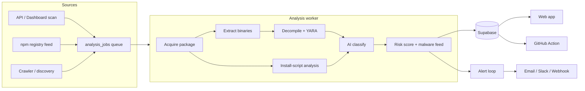

# BinShield

**Catch malicious install scripts and native binaries in your dependencies — before they reach production.**

[](https://github.com/ashlrai/binshield/actions/workflows/ci.yml)
[](LICENSE)


BinShield is a supply-chain security platform for the npm and PyPI ecosystems.
It analyzes the two things attackers actually weaponize — **install scripts**
and **native binaries** — classifies their behavior with AI, cross-references
known-malware feeds, and warns you the moment a package you depend on turns
malicious.

🌐 **[binshield.dev](https://binshield.dev)** · 🔌 **[GitHub Action](apps/github-action/README.md)** · 📖 **[Docs](docs/)**

## The problem

A wave of supply-chain worms — Shai-Hulud and its kin — has shown how fast a
single compromised npm/PyPI package spreads. Two attack surfaces matter:

- **Install scripts.** A malicious `postinstall` hook (or a PyPI `setup.py`)
  runs arbitrary code on every machine that installs the package — stealing
  `NPM_TOKEN`/cloud credentials, opening reverse shells, dropping wipers.
  Most SCA tools never read the `scripts` field.
- **Native binaries.** Compiled `.node`/`.so`/`.dylib`/`.wasm` addons hide
  payloads that no source-level scanner decompiles.

BinShield covers both.

## What BinShield does

| Capability | Detail |
|---|---|
| **Install-script analysis** | Scans npm lifecycle hooks (`preinstall`/`install`/`postinstall`/`prepare`) and PyPI `setup.py`/`pyproject.toml` for `curl\|bash`, `eval` of remote code, credential exfiltration, wipers, reverse shells, and obfuscated payloads. |
| **Native binary analysis** | Ghidra-powered decompilation (with a heuristic fallback) plus YARA pattern matching on `.node`/`.so`/`.dylib`/`.wasm`. |
| **AI classification** | xAI Grok classifies decompiled binaries and install scripts into a supply-chain threat taxonomy; a deterministic heuristic floor runs when AI is unavailable. |
| **Known-malware feed** | Cross-references every scan against OSV malicious-package advisories (`MAL-*`); a confirmed match forces a critical verdict. |
| **Proactive alerts** | When a malicious package is discovered, BinShield matches it against your watchlists and scanned lockfiles and alerts you via email / Slack / webhook. |
| **CI gating** | A GitHub Action scans every PR's dependencies and blocks merges on risky packages. |
| **Reports** | CycloneDX SBOM export and SOC 2 / ISO 27001 / EU CRA compliance reports. |

## Architecture



## Quickstart

```bash
corepack enable          # provides pnpm 10
pnpm install
pnpm dev                 # web app at http://localhost:3000
```

BinShield ships a **demo fallback** — the web app, API, and worker all run
without live credentials (seeded corpus, in-memory store, bundled fixtures),
so you can explore the product before wiring up Supabase / xAI / Stripe.

```bash
pnpm --filter @binshield/api dev                     # API server
BINSHIELD_WORKER_MODE=daemon pnpm --filter @binshield/worker dev   # worker
pnpm typecheck && pnpm test && pnpm build            # the validation gate
```

## Scan your repo in CI

Add the GitHub Action to block malicious dependencies on every PR:

```yaml
- uses: ashlrai/binshield-action@v1
  with:
    api-key: ${{ secrets.BINSHIELD_API_KEY }}
    fail-on: high
```

See [`apps/github-action/README.md`](apps/github-action/README.md) for inputs,
scan modes, and SBOM export.

## Monorepo layout

| Path | Description |
|---|---|
| `apps/web` | Next.js 15 frontend — public package database and dashboard |
| `apps/api` | Hono API — search, scans, orgs, advisories, billing |
| `apps/worker` | Analysis worker — binary + install-script pipeline, feed, crawler |
| `apps/github-action` | CI scanner that gates PRs on dependency risk |
| `apps/video` | Remotion project for the demo video |
| `packages/analysis-types` | Shared domain types and sample data |
| `packages/risk-engine` | Deterministic risk scoring |
| `packages/config` | Environment parsing and product constants |
| `packages/ui` | Shared UI components |
| `packages/cli` | Command-line entry points |

## Documentation

- [Architecture](docs/architecture.md)
- [API reference](docs/api-reference.md)
- [Integration guide](docs/integration-guide.md)
- [Contributing](CONTRIBUTING.md) · [Security policy](SECURITY.md) · [Changelog](CHANGELOG.md)

## License

MIT — see [LICENSE](LICENSE).
